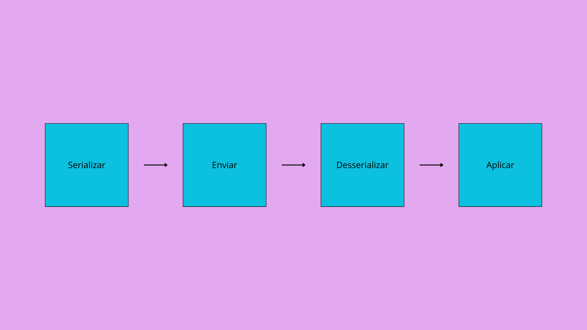

# Troca de parâmetros/pesos/dados entre modelos a partir da rede

O objetivo desse repositório é estudar as maneiras de se implementar a troca de dados/pesos/parâmetros entre modelos de Machine Learning pela rede, utilizando como framework para implementação das IA's o TensorFlow.

## Ideia principal

O workflow pensado para esse projeto foi:
Serializa os dados -> Envia-os pela rede -> Desserializa-os no destino -> Aplica-os onde necessário

## Implementações pensadas

Primariamente, usando TensorFlow, foi pensado na utilização dos seguintes RPC's/protocolos/frameworks que poderiam facilitar essa comunicação:

* gRPC -> Pasta 1st_solution;
* FastAPI;
* SimpleHTTPServer.

## TODO

* [ ] Analisar a viabilidade do gRPC e implementar as outras soluções, se necessárias.
